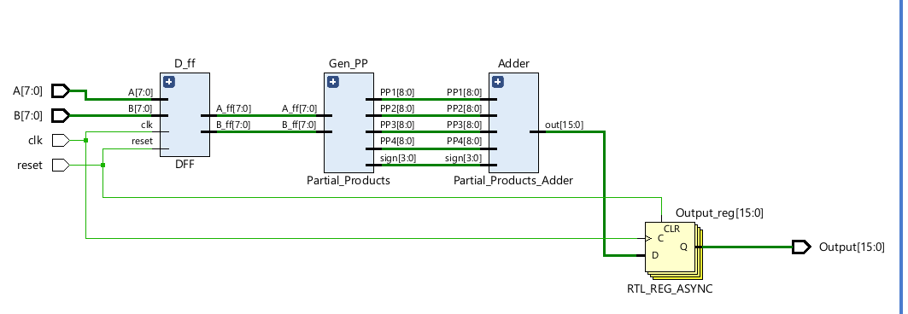
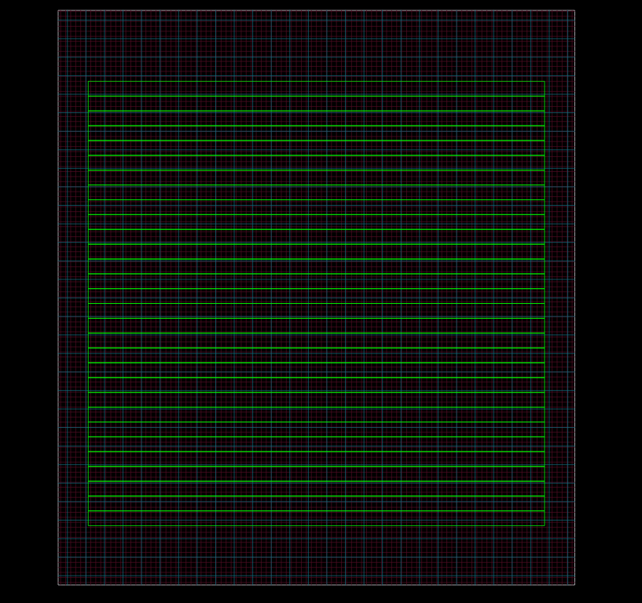
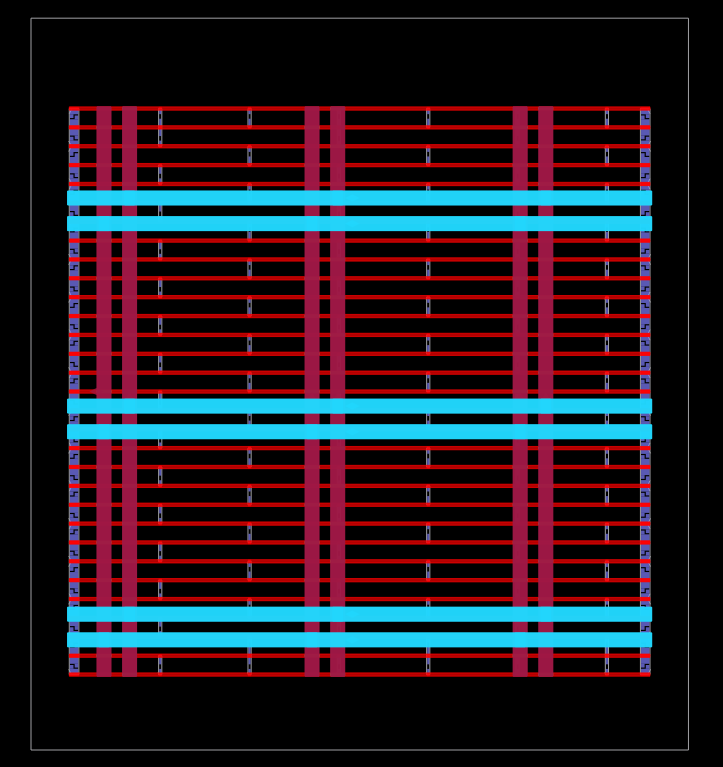
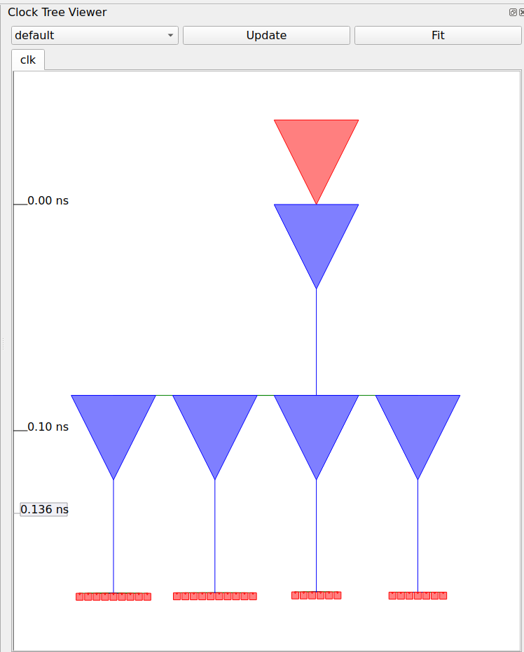
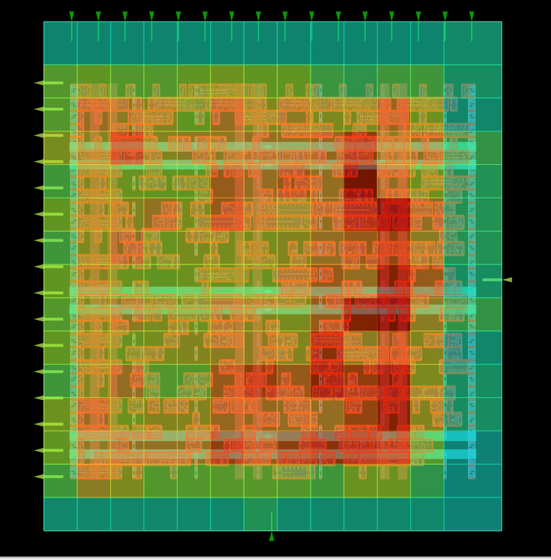
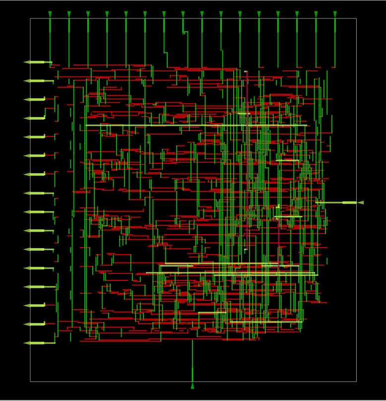
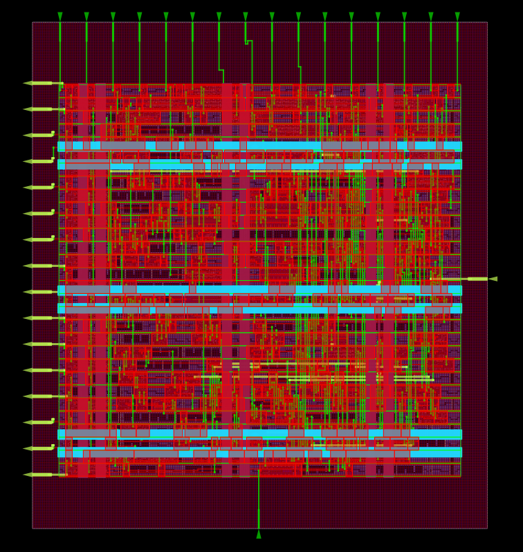

# Pipelined 8-bit Signed Booth-Wallace Tree Multiplier (Radix-4)

## 📌 Overview

This repository contains an optimized hardware implementation of a **Signed 8x8-bit Multiplier** using **Radix-4 Booth Encoding**. The design features **Sign Extension Elimination** to reduce hardware complexity and utilizes a **Wallace Tree** structure for high-speed partial product reduction.

The design includes input/output pipelining to ensure high-speed timing closure and clean signal paths.

## 🚀 Key Features

- **Radix-4 Booth Encoding:** Reduces the partial product count from 8 to 4, halving the adder tree depth.
- **Signed Arithmetic:** Natively handles 2's complement numbers.
- **Wallace Tree Reduction:** Replaces standard ripple-carry addition with a parallel reduction tree (Full/Half Adders) to compress 4 rows into 2 rows (Sum & Carry).
- **Sign Extension Elimination:** Uses the "Inverse Sign" ($\bar{S}$) and "Hot 1" matrix trick to avoid full 16-bit sign extension for every row, saving logic resources.
- **Pipelined Architecture:** A 2-stage pipeline (Input Register $\to$ Logic $\to$ Output Register) ensures short critical paths.

---

## 🏗️ Architecture

The design is modular, separating the encoding logic from the summation logic.

**Block Hierarchy:**

1.  **`Top`:** The wrapper module handling clocking, reset, and I/O registration.
2.  **`DFF`:** Input pipeline stage to buffer `A` and `B` operands.
3.  **`Partial_Products`:** Instantiates 4 parallel **Booth Encoders** to generate partial product rows.
4.  **`Partial_Products_Adder`:** Implements a **Wallace Tree** to reduce the rows and a **Carry Lookahead Adder (CLA)** for the final sum.

_Figure 1: Synthesis Hierarchy showing the modular structure._

---

## 🧠 Algorithm Details

### 1. Radix-4 Booth Encoding

Instead of processing one bit at a time, we process 3 bits of the multiplier ($B_{i+1}, B_i, B_{i-1}$) to determine the operation on the multiplicand ($A$).

| Multiplier Bits | Operation | Description               |
| :-------------- | :-------- | :------------------------ |
| **000, 111**    | $+0$      | Zero                      |
| **001, 010**    | $+A$      | Add Multiplicand          |
| **011**         | $+2A$     | Shift Left (x2)           |
| **100**         | $-2A$     | Shift Left, Invert, Add 1 |
| **101, 110**    | $-A$      | Invert, Add 1             |

### 2. Sign Extension Elimination

Standard multiplication requires sign-extending every partial product to the final width (16 bits), which wastes adder bits. This design uses the optimization constants ($\bar{S}$, $1$) placed in the MSB positions to emulate sign extension without the physical wires.

_Figure 2: Radix-4 Dot Diagram illustrating the partial product alignment and sign extension strategy._

### 3. Wallace Tree Reduction

The addition of the four partial product rows is handled by a **Wallace Tree**, which operates in parallel stages to minimize propagation delay:

1.  **Stage 1 (Reduction):** The 4 partial product rows are grouped by column weight. Full Adders (3-to-2 compression) and Half Adders (2-to-2 compression) reduce the 4 rows down to 3.
2.  **Stage 2 (Compression):** A second layer of adders further reduces the 3 rows down to just 2 final vectors: a **Sum Vector** and a **Carry Vector**.
3.  **Final Addition:** A 16-bit **Carry Lookahead Adder (CLA)** sums the final two vectors to produce the result. This avoids the long carry-propagation delay of ripple carry adders.

---

## 📊 Simulation Results

The design was verified using a self-checking testbench covering corner cases (Max Positive, Max Negative, Zero).

**Waveform Analysis:**
The simulation confirms correct signed multiplication with a **Cycle latency** (Input Reg $\to$ Output Reg).

_Figure 3: Post-Synthesis Verification._

**Test Cases:**

- $4 \times 5 = 20$
- $10 \times -2 = -20$ (Mixed Sign)
- $-10 \times -10 = 100$ (Negative $\times$ Negative)
- $127 \times 127 = 16129$ (Max Positive)
- $-128 \times 1 = -128$ (Max Negative)

---

## 🧰 ASIC Implementation Flow (RTL → GDSII)

After functional verification in Vivado, the design was taken through a complete **RTL-to-GDSII flow** using **LibreLane** with the **Sky130 PDK**.

This stage focuses on **physical feasibility**, **timing closure**, and **power integrity**, converting the RTL into a manufacturable layout.

**Toolchain Used:**

- **Synthesis:** Yosys
- **Floorplanning / PnR / CTS:** OpenROAD
- **DRC / LVS:** Magic + Netgen
- **PDK:** Sky130

## 🔧 Logic Synthesis (Yosys – Sky130)

The verified RTL design was synthesized using **Yosys** targeting the  
**Sky130 standard cell library (`sky130_fd_sc_hd`)**.  
The synthesis flow preserves the Wallace tree structure while aggressively optimizing
logic depth and area.

### 📊 Synthesis Summary

- **Top Module:** `Top`
- **Total Cells:** 361
- **Total Wires:** 350
- **Public Ports:** 5 (34 bits)
- **Sequential Elements:** 32 D Flip-Flops

### 📐 Area Report

    -Total Cell Area : 3857.45 µm²
    -Sequential Area : 840.81 µm²
    -Sequential Percentage : 21.8%

---

## 📐 Floorplanning

The floorplan was generated with a **rectangular die** and a centrally placed core, ensuring sufficient routing channels and clean power distribution.

### 🔹 Key Floorplan Parameters

| Parameter         | Value                                |
| ----------------- | ------------------------------------ |
| Die Bounding Box  | `0.0 0.0 94.785 105.505`             |
| Core Bounding Box | `5.52 10.88 89.24 92.48`             |
| Die Area          | **10000.3 µm²**                      |
| Core Area         | **6831.55 µm²**                      |
| Core Utilization  | **56.47%**                           |
| I/O Pins          | **34**                               |
| Macros            | **None (pure standard-cell design)** |

### 🔹 Floorplan View

  

_Figure: Initial floorplan showing die boundary, core region, and placement rows._

### 🔹 Design Quality

- ✅ **No macros** → simpler clock tree and routing
- ✅ **Moderate utilization (~56%)** → good trade-off between area and timing
- ✅ **Zero flow errors**

This floorplan served as the baseline for **placement, clock tree synthesis (CTS), and routing**, all of which completed with **clean DRC/LVS and timing signoff**.

---

## 🔋 Power Delivery Network (PDN)

A robust **Power Delivery Network (PDN)** was implemented to ensure reliable power distribution across the entire core and to minimize IR drop and electromigration risks during high switching activity of the Wallace-tree datapath.

### 🔹 PDN Configuration Parameters

| Parameter              | Value   |
| ---------------------- | ------- |
| Vertical Strap Width   | 2 µm    |
| Horizontal Strap Width | 2 µm    |
| Vertical Strap Pitch   | 30 µm   |
| Horizontal Strap Pitch | 30 µm   |
| Vertical Offset        | 5 µm    |
| Horizontal Offset      | 5 µm    |
| Trim Power Grid        | Enabled |

These parameters were selected to balance:

- **Low IR drop**
- **Minimal routing blockage**
- **Efficient metal utilization**

### 🔹 PDN Visualization

  

_Figure: Power Delivery Network showing horizontal and vertical power straps across the core._

- **Red rails** represent one supply net (e.g., VPWR)
- **Blue rails** represent the complementary net (e.g., VGND)
- Uniform strap distribution ensures consistent power access throughout the design

---

## 📍 Standard Cell Placement (Global Placement)

After floorplanning and PDN generation, **global placement** was performed using **OpenROAD** to distribute standard cells across the core area while minimizing wirelength and congestion.

The placement step focuses on:

- Reducing total wirelength
- Achieving uniform cell density
- Preparing an optimal starting point for detailed placement and routing

---

### 🔹 Placement Overview

  

_Figure: Global placement view showing standard-cell distribution across the core._

Key observations:

- Cells are **evenly spread** across the core without visible clustering
- No local congestion hotspots are observed
- Power straps and placement rows are respected
- I/O pins are correctly aligned at the periphery

### 🔹 Placement Metrics

| Metric              | Value        |
| ------------------- | ------------ |
| Die Area            | 10,000.3 µm² |
| Core Area           | 6,831.55 µm² |
| Total Instances     | 457          |
| Standard Cells      | 457          |
| Core Utilization    | **58.22%**   |
| Sequential Cells    | 32           |
| Combinational Cells | 290          |
| Inverters           | 39           |
| Tap Cells           | 96           |
| Fill Cells          | 60           |
| Macros              | 0            |

### 🔹 Placement Quality

- ✅ **No placement errors**
- ✅ **No flow warnings**
- ✅ **Uniform cell density**
- ✅ **PDN-aware placement**
- ✅ **Routing-friendly whitespace preserved**

This placement ensures sufficient room for clock tree synthesis (CTS) and detailed routing, especially important for the Wallace-tree datapath with high interconnect density.

---

## ⏱️ Clock Tree Synthesis (CTS)

Clock Tree Synthesis was performed to distribute the clock (`clk`) evenly across all sequential elements while minimizing **skew**, **latency**, and **insertion delay**.

### 🎯 CTS Objectives

- Balanced clock arrival times at all 32 flip-flops
- Minimal clock skew across the design
- Controlled buffer insertion
- Clean clock topology for timing closure

### 🌳 Clock Tree Visualization

_Figure: Clock tree routing over the placed design._

### 🧭 Clock Tree Structure

_Figure: Hierarchical clock tree structure generated by OpenROAD CTS._

### 📈 CTS Report Summary

| Parameter              | Value   |
| ---------------------- | ------- |
| Clock Roots            | 1       |
| Clock Sinks (FFs)      | 32      |
| Clock Buffers Inserted | 5       |
| Clock Subnets          | 5       |
| Worst Clock Skew       | ~28 ps  |
| Clock Latency (max)    | ~251 ps |

### 🧩 Cell Usage After CTS

| Cell Type             | Count   | Area (µm²)  |
| --------------------- | ------- | ----------- |
| Clock Buffers         | 6       | 132.63      |
| Clock Inverters       | 2       | 35.03       |
| Timing Repair Buffers | 33      | 140.13      |
| Sequential Cells      | 32      | 850.82      |
| Combinational Cells   | 290     | 2134.55     |
| Fill + Tap Cells      | 156     | 345.34      |
| **Total**             | **558** | **3784.88** |

The clock tree meets all design constraints with **low skew and balanced latency**, ensuring robust timing behavior across all PVT corners.

---

## 🛣️ Global Routing & Congestion Analysis

After successful Clock Tree Synthesis (CTS), **global routing** was performed using **OpenROAD** to assign routing resources to all signal nets while ensuring congestion-free paths and manufacturability.

Global routing evaluates:

- Routing demand vs. available resources per metal layer
- Congestion hot-spots
- Estimated wirelength
- Antenna rule compliance

---

### 🗺️ Global Routing Heatmap

_Figure: Global routing congestion heatmap.  
Green regions indicate low routing demand, yellow moderate demand, and red localized higher demand areas.  
No routing overflows are observed._

Despite localized high logic density regions (Wallace Tree compressor stages), routing congestion remains **well within limits**.

### 📊 Congestion Report Summary

| Metal Layer | Resource | Demand   | Usage (%)  | Overflow |
| ----------- | -------- | -------- | ---------- | -------- |
| li1         | 0        | 0        | 0.00%      | 0        |
| met1        | 1910     | 557      | 29.16%     | 0        |
| met2        | 1922     | 488      | 25.39%     | 0        |
| met3        | 1252     | 32       | 2.56%      | 0        |
| met4        | 630      | 9        | 1.43%      | 0        |
| met5        | 156      | 0        | 0.00%      | 0        |
| **Total**   | **5870** | **1086** | **18.50%** | **0**    |

✅ **No horizontal, vertical, or total routing overflows** were detected on any layer.

### 📐 Routing Statistics

| Metric                    | Value         |
| ------------------------- | ------------- |
| Routed Nets               | 417           |
| Total Wirelength          | **12,958 µm** |
| Routing Overflows         | 0             |
| Global Routing DRC Errors | 0             |

The moderate wirelength and low metal utilization indicate **efficient placement and good logical locality**, especially for the Wallace Tree reduction network.

### 🛡️ Antenna Rule Check

Antenna checks were performed after routing to ensure no gate oxide damage risk during fabrication.

| Check Type              | Result |
| ----------------------- | ------ |
| Net Violations          | 0      |
| Pin Violations          | 0      |
| Antenna Diodes Inserted | 0      |

✅ **Design is antenna-clean without requiring diode insertion**, indicating well-balanced routing topology.

---

## 🧵 Detailed Routing (DRT)

After successful global routing with zero congestion overflows, **detailed routing** was performed using **OpenROAD TritonRoute** to assign exact wire geometries and vias while satisfying all Design Rule Constraints (DRC).

The router finalized:

- Exact wire tracks per metal layer
- Via placement
- Pin access
- Manufacturability constraints

### 🧩 Detailed Routing View

_Figure: Final detailed routing view showing exact wire paths and via placement across metal layers.  
Red and green tracks correspond to different routing directions across layers._

### 📐 Wirelength Breakdown by Metal Layer

| Layer     | Wirelength (µm) |
| --------- | --------------- |
| li1       | 0               |
| met1      | **3978**        |
| met2      | **3396**        |
| met3      | 297             |
| met4      | 66              |
| met5      | 0               |
| **Total** | **7739 µm**     |

---

### 🔌 Via Statistics

| Metric      | Value    |
| ----------- | -------- |
| Total Vias  | **2609** |
| li1 ↔ met1  | 1315     |
| met1 ↔ met2 | 1244     |
| met2 ↔ met3 | 46       |
| met3 ↔ met4 | 4        |
| met4 ↔ met5 | 0        |

### ✅ Routing Quality Summary

- **Routing Status:** Complete
- **DRC Violations:** 0
- **Shorts / Opens:** None
- **Routing Overflows:** 0
- **Antenna Violations:** 0

The layout is now ready for parasitic extraction, signoff STA, and final GDS generation.

---

## ⏱️ Post-Route Static Timing Analysis (STA)

After detailed routing, **full signoff Static Timing Analysis (STA)** was performed using **OpenSTA** across **all PVT corners** to validate setup, hold, slew, and capacitance constraints.

The analysis confirms that the design meets **timing closure with positive slack across all corners**, including worst-case slow-slow (SS) and fast-fast (FF) conditions.

### 📊 Timing Summary (All Corners)

| Corner               | Hold WNS (ns) | Setup WNS (ns) | Hold Violations | Setup Violations |
| -------------------- | ------------- | -------------- | --------------- | ---------------- |
| **nom_tt_025C_1v80** | +0.5118       | +5.6806        | 0               | 0                |
| **nom_ss_100C_1v60** | +1.1265       | +1.2144        | 0               | 0                |
| **nom_ff_n40C_1v95** | +0.2823       | +7.1885        | 0               | 0                |
| **min_tt_025C_1v80** | +0.5037       | +5.7119        | 0               | 0                |
| **min_ss_100C_1v60** | +1.1124       | +1.2603        | 0               | 0                |
| **min_ff_n40C_1v95** | +0.2768       | +7.1944        | 0               | 0                |
| **max_tt_025C_1v80** | +0.5204       | +5.6483        | 0               | 0                |
| **max_ss_100C_1v60** | +1.1407       | +1.1614        | 0               | 0                |
| **max_ff_n40C_1v95** | +0.2885       | +7.1815        | 0               | 0                |

### 📈 Overall Timings

| Metric                     | Value          |
| -------------------------- | -------------- |
| Worst Setup Slack (WNS)    | **+1.1614 ns** |
| Worst Hold Slack (WNS)     | **+0.2768 ns** |
| Total Negative Slack (TNS) | **0.0 ns**     |
| Setup Violations           | **0**          |
| Hold Violations            | **0**          |

---

## ⚡ Power Integrity & IR Drop Analysis

Post-route **Power Integrity (PI) analysis** was performed using **OpenROAD PDNSim** to verify the robustness of the power delivery network (PDN) under nominal operating conditions.

The analysis confirms **negligible IR drop** across both power and ground nets, validating the correctness of PDN planning and routing.

### 🔋 IR Drop Summary (nom_tt_025C_1v80)

#### VPWR (Power Net)

| Metric             | Value       |
| ------------------ | ----------- |
| Supply Voltage     | 1.80 V      |
| Worst-Case Voltage | 1.80 V      |
| Average Voltage    | 1.80 V      |
| Average IR Drop    | **17.9 µV** |
| Worst-Case IR Drop | **79.8 µV** |
| Percentage Drop    | **~0.00%**  |

#### VGND (Ground Net)

| Metric             | Value       |
| ------------------ | ----------- |
| Supply Voltage     | 0.00 V      |
| Worst-Case Voltage | **123 µV**  |
| Average Voltage    | **16.9 µV** |
| Average IR Drop    | **16.9 µV** |
| Worst-Case IR Drop | **123 µV**  |
| Percentage Drop    | **0.01%**   |

---

### 🧠 Key Observations

- **All VPWR and VGND shapes are fully connected**
- Worst-case IR drop is **< 0.01% of supply voltage**
- No localized power collapse or hot spots detected
- PDN straps and rails are sufficient for the Wallace Tree datapath
- Power integrity margins comfortably meet signoff requirements

✅ **Power delivery network validated**

---

## 🔋 Power Analysis

Post-layout power analysis was performed using **OpenROAD STA + RC extraction** across all signoff corners.  
The design shows **very low power consumption**, which is expected for an 8-bit pipelined arithmetic block implemented in Sky130.

| Power Component | Value        |
| --------------- | ------------ |
| Internal Power  | 0.513 mW     |
| Switching Power | 0.377 mW     |
| Leakage Power   | 3.96 nW      |
| **Total Power** | **0.889 mW** |

#### 🔍 Key Observations

- **Switching power dominates**, which is typical for arithmetic-heavy datapaths.
- **Leakage power is negligible**, confirming efficient use of standard cells and absence of unnecessary always-on logic.
- Pipelining helps reduce glitching and dynamic power by shortening combinational paths.

---

## 🏁 Final Signoff & Tapeout Readiness

After completing RTL-to-GDS flow using **LibreLane (OpenROAD-based)**, the design successfully passes **all signoff checks**:

### ✔ Signoff Checklist

| Check                 | Status           |
| --------------------- | ---------------- |
| LVS (Netgen)          | ✅ Clean         |
| DRC (Magic + KLayout) | ✅ Clean         |
| Antenna               | ✅ No violations |
| XOR (Layout vs GDS)   | ✅ Clean         |
| Setup Timing          | ✅ No violations |
| Hold Timing           | ✅ No violations |
| Max Slew              | ✅ No violations |
| Max Capacitance       | ✅ No violations |
| IR Drop               | ✅ Within limits |

## 🧾 Final GDSII & Signoff

### 📐 Final GDSII Layout

The final **GDSII layout** was generated after completing the full **RTL → GDSII ASIC flow** using **LibreLane (OpenROAD)** on **Sky130 (130 nm)** technology.

